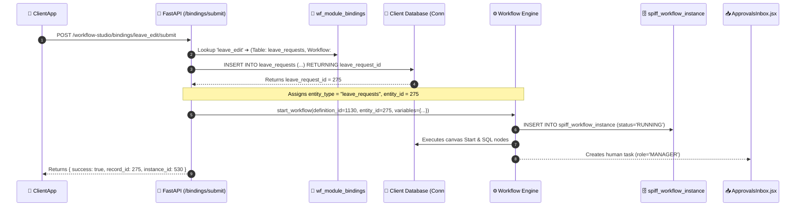

# End-to-End Guide: Creating & Binding a New Workflow to ClientApp

> **Target Audience**: Workflow Designers, Frontend Developers, and System Architects.  
> **Core Objective**: Build, configure, bind, and execute any new enterprise workflow with **Zero Backend Code**.

---

## 🏗️ 1. Architecture Overview (The Big Picture)

The system is built on a **3-Tier Zero-Code Architecture**:

```
 ┌─────────────────────────────────────────────────────────────┐
 │                  1. CLIENTAPP (React UI)                    │
 │  Calls: genericWorkflowApi.submit(module_key, formData)     │
 └──────────────────────────────┬──────────────────────────────┘
                                │ HTTP POST
                                ▼
 ┌─────────────────────────────────────────────────────────────┐
 │               2. WORKFLOW ENGINE & BINDING GATEWAY          │
 │  • Reads 'wf_module_bindings' to resolve module_key         │
 │  • Inserts entity row into Target Table (Connection #4)     │
 │  • Captures auto-generated Primary Key as 'entity_id'       │
 │  • Launches SpiffWorkflow Graph Instance                    │
 └──────────────┬───────────────────────────────┬──────────────┘
                │                               │
                ▼                               ▼
 ┌──────────────────────────────┐ ┌──────────────────────────────┐
 │     3A. CLIENT DATABASE      │ │   3B. WORKFLOW STUDIO DB     │
 │ • Connection #4              │ │ • Schema: workflow           │
 │ • Table: leave_requests, etc.│ │ • Tables: wf_definition,     │
 │ • Holds actual business data │ │   wf_node, spiff_instance   │
 └──────────────────────────────┘ └──────────────────────────────┘
```

---

## 🎨 Phase 1: Designing the Workflow in Workflow Studio

### Step 1.1: Create a New Workflow
1. Open **Workflow Studio** (`http://localhost:5173`).
2. On the **Dashboard**, click **`+ Create New Workflow`** or **`New Flow`**.
3. Enter workflow details:
   * **Workflow Name**: e.g. `Leave Edit & Date Modification Workflow`
   * **Workflow Key**: e.g. `leave_edit_flow`
   * **Category / Entity Type**: e.g. `leave_requests`
   * **Database Connection**: Select `test_emp_leave` (Connection #4).

---

### Step 1.2: Drag & Configure Nodes on the Canvas
Drag the necessary nodes from the left palette onto the canvas and connect them with arrows:

#### 1. Start Node
* **Type**: `Start Event`
* **Label**: `Start Leave Edit`

#### 2. Action / Validation Node (Optional)
* **Type**: `Action Node`
* **Action Type**: `EXECUTE_SQL` or `DB_READ`
* **Purpose**: Query or validate existing balance/data before routing.
* **Example SQL**:
  ```sql
  SELECT remaining_days FROM leave_balances 
  WHERE employee_id = :employee_id AND leave_type_id = :leave_type_id AND year = 2026;
  ```

#### 3. User Task Node (Manager Approval)
* **Type**: `User Task / Approval`
* **Task Code**: `mgr_approval`
* **Label**: `Manager Approval`
* **Assigned Role**: `MANAGER`
* **Actions**: Add two action buttons:
  * Button 1: Label = `Approve`, Action Code = `APPROVE` (Color: Green)
  * Button 2: Label = `Reject`, Action Code = `REJECT` (Color: Red)

#### 4. Decision Gateway (Condition Routing)
* **Type**: `Condition Gateway`
* Connect 2 arrows out of the node:
  * **Arrow 1**: Set Condition / Label = `APPROVE` &rarr; points to Approval branch.
  * **Arrow 2**: Set Condition / Label = `REJECT` &rarr; points to Rejection branch.

#### 5. Record Update Nodes (Automated Database Updates)
* **Approve Branch**:
  * **Type**: `Record Update`
  * **Table**: `leave_requests`
  * **Update Fields**: `{"status": "APPROVED", "start_date": "{{start_date}}", "end_date": "{{end_date}}"}`
  * **Filter**: `leave_request_id = {{entity_id}}`
* **Reject Branch**:
  * **Type**: `Record Update`
  * **Table**: `leave_requests`
  * **Update Fields**: `{"status": "REJECTED"}`
  * **Filter**: `leave_request_id = {{entity_id}}`

#### 6. Communication Node (Automated Email Notification)
* **Type**: `Communication Node`
* **Action Type**: `EMAIL`
* **To**: `{{employee_email}}`
* **Subject**: `Leave Edit Request #{{entity_id}} Approved`
* **Body**: `Hello {{employee_name}}, your requested date changes have been APPROVED by your Manager.`

#### 7. End Nodes
* **Type**: `End Event`
* Set **Outcome**: `APPROVED` on the approved branch, and `REJECTED` on the rejected branch.

---

### Step 1.3: Save & Publish the Workflow
1. Click **`Save Draft`** in the top navbar.
2. Click **`Publish`** to make this version active for production execution.
3. Note the generated **Workflow ID** (e.g. `1130`).

---

## 🔗 Phase 2: Binding the Workflow to ClientApp

Now you link this workflow diagram to your frontend application using the **"🔗 Bind to ClientApp"** modal.

### Step 2.1: Open the Binding Modal
1. On the canvas or dashboard row, click **`🔗 Bind to ClientApp`**.

### Step 2.2: Fill the Binding Modal Fields
| Field | What to Enter | Example | Why It Matters |
| :--- | :--- | :--- | :--- |
| **Module Key** | A unique, lowercase slug | `leave_edit` | The keyword your React frontend calls. |
| **Module Title** | Human-readable title | `Leave Edit & Date Modification` | Shown in audit logs and headers. |
| **Database Connection** | Target DB Connection | `#4 (test_emp_leave)` | Identifies which DB receives data. |
| **Primary Trigger Table** | Target business table | `leave_requests` | Table where records get inserted/updated. |
| **Primary Key Column** | Table's ID column | `leave_request_id` | Becomes `entity_id` for workflow tracking. |
| **Status Column** | Approval state column | `status` | Updated when approved or rejected. |
| **Default Status** | Initial state | `PENDING_EDIT` | Set upon initial submission. |
| **Approval Roles** | Permitted approver roles | `["MANAGER", "ADMIN"]` | Filters tasks in `ApprovalsInbox.jsx`. |

### Step 2.3: Save Binding
* Click **`💾 Save Binding`**.
* The engine creates/updates the row in `workflow.wf_module_bindings`.
* **Zero backend code or server restarts required!**

---

## 💻 Phase 3: Integrating with ClientApp (React)

You only need to write **one function in your React component**.

### Step 3.1: Import the Generic API Client
In your React component (e.g. [`LeaveModule.jsx`](file:///d:/WorkFlow/ClientApp/src/components/LeaveModule.jsx)):

```javascript
import { genericWorkflowApi } from '../services/genericWorkflowApi';
```

---

### Step 3.2: Submit Form Data to the Workflow
When the user submits the form, call `genericWorkflowApi.submit()`:

```javascript
/**
 * Triggers the newly bound workflow
 */
const handleSubmit = async (e) => {
  e.preventDefault();
  setIsSubmitting(true);

  try {
    // 1. Construct the payload matching your table columns
    const payload = {
      leave_request_id: Number(selectedLeaveId),
      start_date: startDate,
      end_date: endDate,
      days: Number(calculatedDays),
      reason: reasonText,
      edit_reason: editReasonNotes,
      status: 'PENDING_EDIT' // Matches default_status
    };

    // 2. Submit to the exact module_key you registered in Phase 2
    const result = await genericWorkflowApi.submit(
      'leave_edit',   // 👈 Exact module_key from Binding Modal
      payload,        // 👈 Form data object
      currentUser     // 👈 { id: 5, name: 'Jasmin', role: 'EMPLOYEE' }
    );

    console.log("Record ID generated:", result.record_id);
    console.log("Workflow instance:", result.instance_id);

    // 3. Provide user feedback & refresh records
    alert(`Request submitted successfully! Reference #${result.record_id}`);
    await loadRecords();

  } catch (error) {
    console.error("Submission failed:", error);
    alert("Submission error: " + error.message);
  } finally {
    setIsSubmitting(false);
  }
};
```

---

### Step 3.3: Approvals Inbox (`ApprovalsInbox.jsx`)
**NO CODE CHANGES NEEDED!**
* `ApprovalsInbox.jsx` is 100% generic.
* It automatically detects pending tasks for `leave_edit`.
* When Manager Rajesh Kumar logs in, he sees the task card:
  ```
  leave_edit #275 • Requires action for leave_edit record #275
  [ Approve ]   [ Reject ]
  ```
* Clicking **Approve** or **Reject** automatically executes the workflow transition!

---

## ⚙️ Phase 4: Runtime Execution Sequence

Here is what happens under the hood when the button is clicked:



---

## 🔍 Phase 5: Monitoring & Verification

1. Open **Workflow Studio** &rarr; click **`Monitoring`** tab.
2. Filter by Entity: `leave_requests` or Status: `Running`.
3. Click **`Instance #530`**:
   * **Variables Tab**: Inspect all payload fields (`start_date`, `days`, `employee_name`, `entity_id`).
   * **Traces Tab**: Verify each step executed with execution timestamps in 12-hour format (`Sep 3, 2026, 02:05 PM`).
   * **Transitions Tab**: See who approved, when, and their remarks.

---

## 📋 Quick Reference Checklist

| Step | Action | Tool / File | Lines of Code |
| :-: | :--- | :--- | :-: |
| **1** | Draw Canvas & Publish | Workflow Studio Designer | **0** |
| **2** | Click "🔗 Bind to ClientApp" | Binding Modal | **0** |
| **3** | Call `genericWorkflowApi.submit()` | `ClientApp/src/components/...` | **1 call** |
| **4** | Review Tasks in Inbox | `ApprovalsInbox.jsx` | **0 (Automatic)** |
| **5** | Monitor Execution | Workflow Studio Monitoring | **0** |
