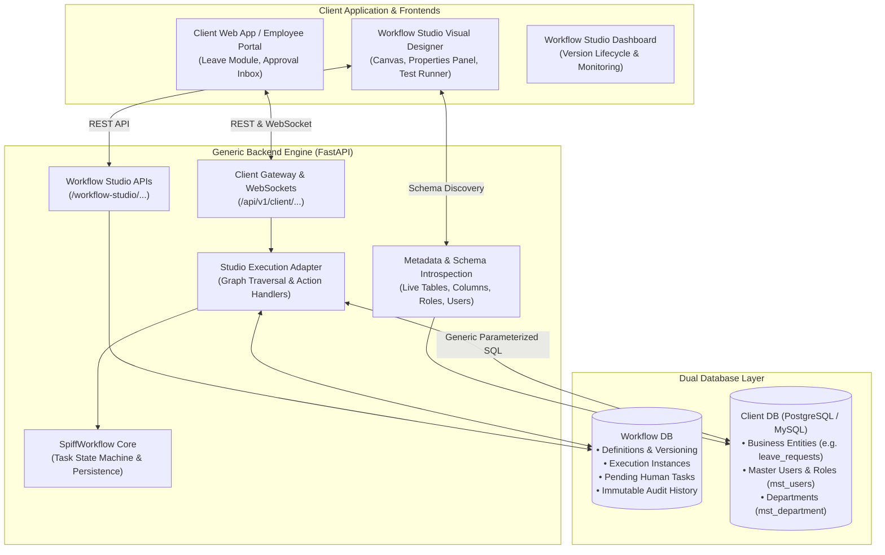

# ⚡ Enterprise Workflow Platform & Studio

An enterprise-grade, **100% UI + Database-Driven Workflow Orchestration Platform** featuring a **Generic Python FastAPI / SpiffWorkflow Engine**, an interactive **React 19 / @xyflow Visual Designer**, and a **Real-Time Client Application Gateway**.

The platform enables organizations to visually design, validate, publish, execute, and monitor complex business workflows (such as Multi-Tier Risk Approvals, Leave Management, Purchase Orders, and 3rd-Party API integrations) **without writing or modifying any backend Python code**.

---

## 🌟 Core Architectural Principles

1. **100% UI + Client Database Driven**: Workflow routing, decision branches, human task assignments, email templates, and database operations are fully configured via the UI and stored as versioned graphs.
2. **Zero Domain-Specific Hardcoding**: The Python backend serves strictly as a generic graph traversal engine. No hardcoded tables, column names, status codes, or business logic exist in backend code.
3. **Dual Database Architecture**:
   - **Client Database (PostgreSQL / MySQL / SQLite)**: The single source of truth for business data (e.g. `leave_requests`, `risk_register`, `mst_users`, `mst_department`, `mst_user_role`).
   - **Workflow Database**: Stores workflow specifications, versions, node configurations, active instances, task state machines, execution logs, and audit trails.
4. **Automated Database CRUD & Schema Discovery**: Generic `CREATE_RECORD` (`INSERT`), `READ_RECORD` (`SELECT`), `UPDATE_RECORD` (`UPDATE`), and `DELETE_RECORD` (`DELETE`) execution nodes automatically introspect client database schemas and execute parameterized SQL safely with primary key resolution and conflict handling.
5. **REST API & Webhook Integration**: Built-in `API Call` node orchestrates external services (HTTP `GET`, `POST`, `PUT`, `PATCH`, `DELETE`) with dynamic template body interpolation and response variable capture.
6. **Real-Time Client Application Gateway**: Complete WebSocket and REST endpoints for client applications (e.g. Employee Portals, Admin Dashboards) to trigger workflows, fetch pending tasks, submit decisions, and receive instant updates.
7. **Complete Audit Trail**: Immutable logging of every state transition, actor, decision outcome, and execution timestamp in `workflow_history`.

---

## 🏗️ System Architecture



---

## 🎨 Supported Visual Node Types

| Node Type | Category | Key Features & Capabilities |
| :--- | :--- | :--- |
| **`START`** | Trigger / Boundary | Workflow entry point triggered via Client App API (`/api/v1/client/trigger`), webhook, or manual submission. |
| **`USER_TASK`** | Execution | Human review gate assigned dynamically to a **Role**, **User**, or **Department** loaded from live metadata. Supports custom decision buttons (e.g. `Approve`, `Reject`, `Request Changes`). |
| **`APPROVAL`** | Execution | Multi-tier approval gate with hierarchical routing, rejection handling, and escalation policies. |
| **`CREATE_RECORD`** | Database Action | Automated insert (`INSERT INTO ... RETURNING *`) with **Option B Full Schema Grid**, type-aware presets (`NOW()`, `CURRENT_DATE`, `True`/`False`), FK constraints, and duplicate conflict rules (`ON CONFLICT DO NOTHING / DO UPDATE`). |
| **`UPDATE_RECORD`** | Database Action | Automated field modification (`UPDATE ... SET ... WHERE id = :entity_id`) targeting client DB records upon approvals. |
| **`READ_RECORD`** | Database Action | Dynamic query (`SELECT ... FROM ... WHERE ...`) retrieving entity fields into runtime memory for downstream conditions or emails. |
| **`DELETE_RECORD`** | Database Action | Parameterized record deletion with filter safeguards. |
| **`API_CALL`** | Integration | Outbound REST HTTP call (`GET`, `POST`, `PUT`, `PATCH`, `DELETE`) with dynamic headers, JSON template payload, and `api_response` variable storage. |
| **`CONDITION`** | Control-Flow | Dynamic rule evaluation supporting numeric (`>`), boolean (`== true`), string (`== "ACTIVE"`), and multi-condition expressions without arbitrary code execution. |
| **`SWITCH`** | Control-Flow | Multi-way branching based on discrete field values (e.g. `HIGH`, `MEDIUM`, `LOW`). |
| **`COMMUNICATION`** | Execution | Rich templated email dispatcher with interactive HTML preview, dynamic variable chips (`{{entity_id}}`, `{{user_name}}`), and CC/BCC routing. |
| **`END`** | Boundary | Terminal state completing workflow execution (`COMPLETED`, `APPROVED`, `REJECTED`). |

---

## 🚀 Quick Start Guide

### Prerequisites
* **Python 3.9+**
* **Node.js 18+** & `npm`
* **PostgreSQL** (or compatible database) running with the Client Database

---

### 1. Backend Setup & Startup

```powershell
# Navigate to backend directory
cd backend

# Activate virtual environment (Windows PowerShell)
.\.venv\Scripts\Activate.ps1

# Install dependencies (if first time)
pip install -r requirements.txt

# Start the FastAPI server
uvicorn app.main:app --host 127.0.0.1 --port 8000 --reload
```

* **Backend API Base:** `http://127.0.0.1:8000`
* **Interactive API Documentation (Swagger UI):** `http://127.0.0.1:8000/docs`

---

### 2. Workflow Studio Frontend Setup

```powershell
# In a separate terminal, navigate to frontend directory
cd frontend

# Install frontend dependencies
npm install

# Start Vite dev server
npm run dev
```

* **Workflow Studio Designer:** `http://localhost:5173`

---

### 3. Client Application Portal (Demo App)

```powershell
# In a separate terminal, navigate to ClientApp directory
cd ClientApp

# Install dependencies
npm install

# Start Client App dev server
npm run dev
```

* **Client App Portal:** `http://localhost:5174`

---

## 🧪 Testing & Simulation Tools

### 1. In-Designer Interactive Test Runner (`▷ Test Flow`)
From the Workflow Designer toolbar, click **`▷ Test Flow`**:
* **Step-by-Step Simulation**: Step through the entire graph node by node with live branch highlighting.
* **Database State Inspector**: Inspect before/after state of Client DB business entities.
* **SQL Execution Trace**: View all executed SQL queries, HTTP request/response payloads, and millisecond execution times.

### 2. Direct Query / API Tester
* In **Record Nodes**: Scroll down to the **Live SQL Preview** panel and click **`▶ Test Query`** to execute the query against the connected database in real-time.
* In **API Call Nodes**: Execute live requests against public or private webhook endpoints.

### 3. Automated Backend Test Suites
Run comprehensive end-to-end integration and acceptance tests:
```powershell
cd backend
.\.venv\Scripts\python.exe test_step9.py
.\.venv\Scripts\python.exe test_client_gateway.py
.\.venv\Scripts\python.exe test_executor.py
```

---

## 🔗 Client Application Integration (SDK)

Workflows can be bound to any external frontend or microservice in three simple steps:

### 1. Trigger Workflow
```javascript
const response = await fetch('http://127.0.0.1:8000/api/v1/client/trigger', {
  method: 'POST',
  headers: { 'Content-Type': 'application/json' },
  body: JSON.stringify({
    workflow_code: 'LEAVE_APPROVAL_FLOW',
    entity_id: 42,
    variables: { employee_id: 5, days: 3, reason: 'Annual Leave' }
  })
});
const { instance_id } = await response.json();
```

### 2. Fetch Pending Tasks for Logged-In User
```javascript
const res = await fetch(`http://127.0.0.1:8000/api/v1/client/tasks?user_id=3&role_id=2`);
const pendingTasks = await res.json();
```

### 3. Complete Task / Submit Approval
```javascript
await fetch('http://127.0.0.1:8000/api/v1/client/complete-task', {
  method: 'POST',
  headers: { 'Content-Type': 'application/json' },
  body: JSON.stringify({
    task_id: 'task-102',
    action: 'APPROVE',
    user_id: 3,
    comment: 'Approved as requested'
  })
});
```

---

## 🔒 Security & Performance Features

* **Parameterized SQL**: All database operations use strictly parameterized SQLAlchemy constructs to eliminate SQL injection vulnerabilities.
* **Safe Condition Evaluation**: Condition expressions use an AST-based tokenizer to prevent arbitrary Python code execution.
* **Zero Secrets in Code**: Database connection strings and tokens are managed exclusively through environment configurations.
* **In-Memory Metadata Caching**: Table schemas, column definitions, and master roles are cached for sub-millisecond response times in the visual designer.

---

## 📄 License
This project is licensed under the **Enterprise Proprietary License**. All rights reserved.
