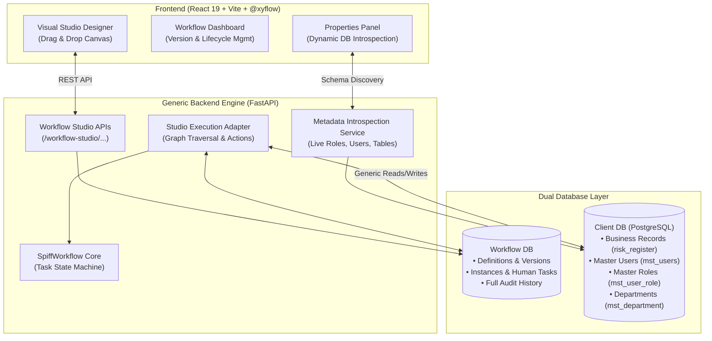
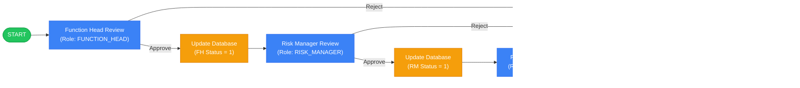

# ⚡ Enterprise Workflow Platform & Studio

An enterprise-grade, **100% UI + Database-Driven Workflow Orchestration Platform** featuring a **Generic Python FastAPI / SpiffWorkflow Engine** and a modern **React 19 / @xyflow Visual Designer**.

The platform enables organizations to build, configure, publish, and execute complex business workflows (such as Multi-Tier Risk Approvals, Invoice Processing, and HR Requests) directly from the visual interface **without writing or modifying any Python code**.

---

## 🌟 Core Architectural Principles

1. **100% UI + Client Database Driven**: Workflow structure, approval hierarchies, routing rules, and database operations are fully configured via the UI and stored as data.
2. **Zero Domain-Specific Hardcoding**: The Python backend acts solely as a generic graph execution engine. No hardcoded tables, column names, status IDs, or business rules exist in the code.
3. **Dual Database Architecture**:
   - **Client Database (`PostgreSQL`)**: Source of truth for business data (e.g. `risk_register`, `mst_users`, `mst_department`, `mst_user_role`).
   - **Workflow Database**: Stores workflow definitions, versions, visual node graphs, runtime instances, human tasks, and audit logs.
4. **Automated Database Reads & Writes**: Generic `DB_READ`, `DB_UPDATE`, and `DB_CREATE` execution nodes allow workflows to dynamically manipulate Client DB records upon task approvals.
5. **Complete Audit Trail**: Immutable logging of every state transition, user action, role, and timestamp in `workflow_history`.

---

## 🏗️ System Architecture



---

## 📁 Repository Structure

```text
WorkFlow/
├── backend/                       # Generic FastAPI Backend Engine
│   ├── app/
│   │   ├── core/                  # Database connections, logging, dependencies
│   │   │   ├── database.py        # ClientDatabaseAdapter (Dynamic Introspection & Generic SQL)
│   │   │   └── config.py          # Dual DB connection settings
│   │   ├── workflow/              # Workflow DB models, Spiff runtime, session management
│   │   ├── workflow_studio/       # Studio REST API, compiler, validator, runtime adapter
│   │   │   ├── api.py             # Workflow CRUD & Metadata endpoints
│   │   │   ├── schemas.py         # Pydantic validation schemas
│   │   │   ├── services.py        # Studio graph validation & lifecycle management
│   │   │   └── runtime/
│   │   │       ├── actions.py     # Generic Condition Evaluator & DB Action Handlers
│   │   │       └── adapter.py     # End-to-end studio execution adapter
│   │   └── main.py                # FastAPI app entry point
│   ├── manager_demo.py            # Live demo demonstrating both databases in action
│   ├── live_demo.py               # E2E live database modification demonstration
│   ├── test_step7.py              # Step 7 Automated Test Suite
│   ├── test_step8.py              # Step 8 Generic DB Write Acceptance Tests (25/25)
│   ├── test_step9.py              # Step 9 Full End-to-End Pipeline Tests (25/25)
│   ├── test_user_task_client_db.py# User Task Client DB Integration Tests
│   └── requirements.txt           # Backend Python dependencies
│
├── frontend/                      # Visual Workflow Studio UI
│   ├── src/
│   │   ├── components/            # Studio Components
│   │   │   ├── Dashboard.jsx      # Workflow list, create draft, and import
│   │   │   ├── Designer.jsx       # Visual canvas, toolbar, and validation modal
│   │   │   ├── NodeLibrary.jsx    # Draggable node palette
│   │   │   ├── PropertiesPanel.jsx# Live metadata assignment & DB field mapping
│   │   │   └── nodes/
│   │   │       └── CustomNodes.jsx# Custom ReactFlow nodes (Start, Task, Action, End)
│   │   ├── services/
│   │   │   └── workflowStorage.js # High-performance API service with in-memory caching
│   │   ├── App.jsx                # Navigation & layout container
│   │   └── index.css              # Dark-mode design system & animations
│   ├── package.json               # Frontend dependencies (React 19, @xyflow, Lucide)
│   └── vite.config.js             # Vite config with backend proxy
│
└── README.md                      # Project documentation
```

---

## 🚀 Quick Start Guide

### Prerequisites
* **Python 3.9+**
* **Node.js 18+** & `npm`
* **PostgreSQL** running with the Client Database

---

### 1. Backend Setup & Startup

```powershell
# Navigate to backend directory
cd d:\WorkFlow\backend

# Activate virtual environment (Windows PowerShell)
.\.venv\Scripts\Activate.ps1

# Start the FastAPI server
uvicorn app.main:app --host 127.0.0.1 --port 8000 --reload
```

* **Backend URL:** `http://127.0.0.1:8000`
* **Interactive API Docs (Swagger):** `http://127.0.0.1:8000/docs`

---

### 2. Frontend Studio Setup & Startup

```powershell
# In a separate terminal, navigate to frontend directory
cd d:\WorkFlow\frontend

# Install dependencies (if first time)
npm install

# Start Vite dev server
npm run dev
```

* **Visual Studio URL:** `http://localhost:5173`

---

## 🧪 Live Demonstrations & Testing

### 1. Run the Manager Demonstration (Dual Database Audit)
To verify live state changes across **both databases** simultaneously:
```powershell
cd d:\WorkFlow\backend
.\.venv\Scripts\python.exe manager_demo.py
```
**What this verifies:**
1. Queries initial business record in Client DB (`mst_department`).
2. Creates and publishes a workflow with human approval and automated DB update.
3. Starts workflow $\to$ verifies Workflow DB instance status is **`WAITING`** and task is **`READY`** while business record remains unchanged.
4. Executes **`APPROVE`** $\to$ automated `DB_UPDATE` updates Client DB record live.
5. Verifies 3-hop audit trail logged in `workflow_history`.

---

### 2. Run Step 9 Acceptance Tests
To validate full graph traversal (`START -> DB_READ -> CONDITION -> USER_TASK -> APPROVE -> DB_UPDATE -> END`):
```powershell
cd d:\WorkFlow\backend
.\.venv\Scripts\python.exe test_step9.py
```

---

## 🎨 Supported Visual Node Types

| Node Type | Category | Functionality |
| :--- | :--- | :--- |
| **`START`** | Boundary | Entry point triggered upon business event or manual submission. |
| **`USER_TASK`** | Execution | Human review gate dynamically assigned to a **Role**, **User**, or **Department** loaded from `mst_user_role`, `mst_users`, or `mst_department`. Supports multiple decision branches (`Approve`, `Reject`). |
| **`APPROVAL`** | Execution | Specialized approval gate with configurable multi-level decision outcomes. |
| **`ACTION` (Update Record)** | Execution | Automated write to any Client DB table (e.g. `risk_register`) with dynamic field mappings and template variable substitution. |
| **`ACTION` (Create Record)** | Execution | Automated insert of a new record into any Client DB table. |
| **`ACTION` (Read Record)** | Execution | Dynamic fetch of entity data into workflow memory for downstream condition evaluation. |
| **`CONDITION`** | Control-Flow | Dynamic rule router evaluating expressions (e.g. `{{amount}} > 50000`). |
| **`COMMUNICATION`** | Execution | Templated email and in-app notification dispatch. |
| **`END`** | Boundary | Terminal point marking workflow completion (`ACTIVE_APPROVED`, `REJECTED`, etc.). |

---

## 🛡️ Enterprise Multi-Tier Workflow Example

Below is the visual governance architecture for the **Enterprise Risk 3-Tier Approval Workflow**:



---

## 🔒 Security & Best Practices
* **Zero Hardcoded Secrets**: Database credentials managed through `.env` files.
* **SQL Injection Prevention**: All dynamic queries execute via parameterized SQLAlchemy constructs and sanitized column whitelists.
* **Transaction Safety**: Atomic database updates ensure consistency between workflow instance state and business records.
* **High-Performance In-Memory Cache**: UI metadata queries are cached to ensure instant (0ms) response times during node configuration.

---

## 📄 License
This project is licensed under the **Proprietary / Enterprise License**. All rights reserved.
